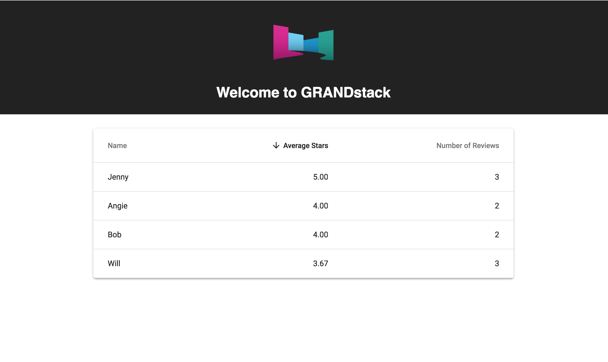

[](https://app.netlify.com/start/deploy?repository=https://github.com/grand-stack/grand-stack-starter) [](https://deploy.now.sh/?repo=https://github.com/grand-stack/grand-stack-starter&env=NEO4J_USER&env=NEO4J_URI&env=NEO4J_PASSWORD)

# GRANDstack Starter

This project is a starter for building a [GRANDstack](https://grandstack.io) (GraphQL, React, Apollo, Neo4j Database) application. There are two components to the starter, the UI application (in React and Angular flavors) and the API app (GraphQL server).

[](http://www.youtube.com/watch?v=rPC71lUhK_I 'Hands On With The GRANDstack Starter')
_Hands On With The GRANDstack Starter Video_

## Quickstart

The easiest way to get started with the GRANDstack Starter is to create a Neo4j Sandbox instance and use the `create-grandstack-app` command line tool.

1. Create A Neo4j Sandbox Instance

Neo4j Sandbox allows you to create a free hosted Neo4j instance private to you that can be used for development.

After singing in to Neo4j Sandbox, click the `+ New Project` button and select the "Blank Sandbox" option. In the next step we'll use the connection credentials from the "Connection details" tab to connect our GraphQL API to this Neo4j instance.


2. Run the `create-grandstack-app` CLI

```
npx create-grandstack-app myNewApp
```

or with Yarn

```
yarn create grandstack-app myNewApp
```


This will create a new directory `myNewApp`, download the latest release of the GRANDstack Starter, install dependencies and prompt for your connection credentials for Neo4j to connect to the GraphQL API.

3. Seed the database (optional)

Once the application is running, in another terminal run

```
npm run seedDb
```

or with Yarn

```
yarn run seedDb
```

4. Open In Browser


## Overview

The GRANDstack Starter is a monorepo that includes a GraphQL API application and client web applications for React (default) and Angular.

### [`/api`](./api)

_Install dependencies_

```
(cd ./ui-react && npm install)
(cd ./ui-angular && npm install)
(cd ./api && npm install)
```

_Start API server_

```
cd ./api && npm start
```


### [`/ui-react`](./ui-react)

This will start the GraphQL API in the foreground, so in another terminal session start the React UI development server:

_Start the React UI server_

```
cd ./ui-react && npm start
```



### [`/ui-angular`](./ui-angular)

A UI built with [Angular](https://angular.io), [Apollo](https://www.apollographql.com/docs/angular/) and the [Clarity Design System](https://clarity.design) is also available.

_Start the Angular UI server_

```
cd ./ui-angular && npm start
```


See [the project releases](https://github.com/grand-stack/grand-stack-starter/releases) for the changelog.

## Deployment

### Netlify

### Vercel

Zeit Now v2 can be used with monorepos such as grand-stack-starter. [`now.json`](https://github.com/grand-stack/grand-stack-starter/blob/master/now.json) defines the configuration for deploying with Zeit Now v2.

1. Set the now secrets for your Neo4j instance:

```
now secret add grand_stack_starter_neo4j_uri bolt://<YOUR_NEO4J_INSTANCE_HERE>
now secret add grand_stack_starter_neo4j_user <YOUR_DATABASE_USERNAME_HERE>
now secret add grand_stack_starter_neo4j_password <YOUR_DATABASE_USER_PASSWORD_HERE>
```

2. Run `now`

## Docker Compose

You can quickly start via:

```
docker-compose up -d
```

If you want to load the example DB after the services have been started:

```
docker-compose run api npm run seedDb
```

This project is licensed under the Apache License v2.
Copyright (c) 2020 Neo4j, Inc.
